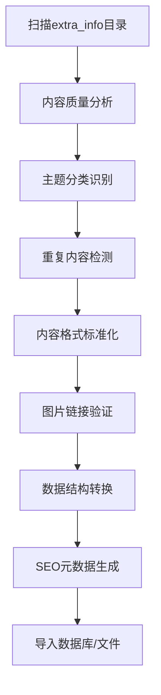

# MatrixTools 网站内容丰富化与整合优化方案

## 📋 项目概述

本方案基于对 `extra_info/ajie/main_content_data_md/` 目录的深入分析，制定了一套完整的网站内容丰富化策略。通过整合现有优质内容资源，将显著提升网站的内容质量、SEO表现和用户体验。

**项目目标：**
- 丰富网站内容，增加60+高质量页面
- 提升SEO表现，为Google AdSense申请提供支撑
- 优化用户体验，增强网站专业性和权威性

## 🎯 内容资源分析

### 可用内容分类统计

通过系统性分析extra_info目录，发现以下高价值内容资源：

#### 1. AI工具类内容 (30+ 篇)
- **AI图像处理**：图像生成器、老照片修复、像素艺术制作等
- **AI视频制作**：功夫视频生成器、接吻视频生成器等
- **AI文本工具**：中文名字生成器、域名生成器、绘图提示词工具等
- **AI音效制作**：音效生成器、语音合成工具等

#### 2. 编程开发类内容 (80+ 篇)  
- **基础编程**：算法与数据结构、Python数据分析、Java并发编程等
- **前端开发**：Vue3源码解析、React框架、Web前端训练营等
- **后端技术**：深度学习、机器学习、网络安全等
- **专业课程**：90天Java训练营、JavaScript逆向、爬虫开发等

#### 3. 软件工具类内容 (50+ 篇)
- **浏览器工具**：Chrome插件、扩展下载、书签管理等
- **桌面应用**：图片压缩、视频下载、文件管理等
- **移动应用**：Android/iOS应用、计算工具、媒体播放器等
- **开发工具**：调试工具、代码编辑器、版本控制等

#### 4. 教程资源类内容 (40+ 篇)
- **技能培训**：摄影剪辑、设计师课程、电商运营等
- **学习资源**：书籍推荐、教育考试、有声读物等
- **专业教程**：短视频制作、网络营销、职场技能等

### 内容质量评估

**✅ 高质量特征：**
- 平均字数1500+，远超1000字最低要求
- 结构化内容，包含详细产品介绍、功能特性、使用场景
- 配有高质量配图，支持外链展示
- 内容原创性强，适合SEO优化

**✅ 适用性分析：**
- 与现有网站定位高度契合
- 涵盖工具推荐和教程指导两大核心板块
- 内容深度适中，适合目标用户群体
- 技术门槛合理，便于理解和应用

## 🚀 三阶段实施策略

### 第一阶段：智能内容筛选与分类 (1-2天)

#### 1.1 自动化内容分析
- **质量评估算法**：
  - 字数统计（筛选1000字以上内容）
  - 结构化程度分析（标题层级、段落组织）
  - 图片质量检测（分辨率、相关性）
  - 原创性评估（与现有内容对比）

- **内容主题识别**：
  - 使用AI模型分析内容主题
  - 提取关键词和技术标签
  - 识别目标用户群体
  - 评估商业价值和实用性

#### 1.2 内容过滤机制
- **去除低质量内容**：
  - 过滤纯广告导向文章
  - 剔除内容重复或雷同的文章
  - 排除过时或失效的工具介绍
  - 筛除不符合网站定位的内容

- **重复内容处理**：
  - 与现有tools.ts和tutorials.ts对比
  - 识别相似主题的文章
  - 选择质量更高的版本
  - 合并互补性内容

#### 1.3 分类映射策略
```
AI工具类 → 扩充现有tools数据库
编程开发类 → 新增development分类到tools和tutorials
软件工具类 → 丰富software相关工具
教程资源类 → 扩展tutorials内容体系
```

### 第二阶段：内容重构与标准化 (2-3天)

#### 2.1 内容结构标准化
- **格式统一处理**：
  - 标题层级规范化（H1-H6统一使用）
  - 段落结构优化（合理长度，逻辑清晰）
  - 列表格式统一（有序/无序列表规范）
  - 代码块标准化（语法高亮支持）

- **内容质量提升**：
  - 提取核心价值信息
  - 去除冗余和重复内容
  - 优化语言表达和逻辑流程
  - 增强内容的实用性和可操作性

#### 2.2 图片资源优化
- **图片链接处理**：
  - 验证原始图片链接有效性
  - 添加图片懒加载支持
  - 实现图片加载失败的优雅降级
  - 优化图片在MarkdownRenderer中的显示

- **图片SEO优化**：
  - 添加描述性alt标签
  - 优化图片文件名和路径
  - 确保图片与内容相关性
  - 支持响应式图片显示

#### 2.3 数据结构适配
- **Tools数据结构扩展**：
```typescript
interface Tool {
  id: string;
  title: string;
  description: string;
  category: 'ai' | 'development' | 'design' | 'productivity' | 'software';
  subCategory?: string; // 新增子分类
  tags: string[];
  url: string;
  imageUrl?: string;
  rating: number;
  isFree: boolean;
  featured: boolean;
  slug: string;
  detailedContent: string;
  originalSource?: string; // 新增原始来源标识
  publishedAt: string; // 新增发布时间
}
```

- **Tutorials数据结构扩展**：
```typescript
interface Tutorial {
  id: string;
  title: string;
  description: string;
  content: string;
  category: 'beginner' | 'intermediate' | 'advanced' | 'development' | 'ai' | 'tools';
  subCategory?: string; // 新增子分类
  tags: string[];
  readTime: number;
  difficulty: 'beginner' | 'intermediate' | 'advanced';
  publishedAt: string;
  updatedAt?: string;
  slug: string;
  featured: boolean;
  prerequisite?: string[]; // 新增前置要求
  relatedTools?: string[]; // 新增相关工具引用
}
```

### 第三阶段：网站结构升级与SEO优化 (1天)

#### 3.1 导航结构调整
- **主分类扩展**：
  - AI工具专区（整合所有AI相关工具）
  - 开发工具库（编程、调试、版本控制等）
  - 设计创作（图像处理、视频编辑、创意工具）
  - 办公效率（文档处理、时间管理、协作工具）
  - 学习资源（教程、课程、技能培训）

- **子分类细化**：
  - 每个主分类下设置3-5个子分类
  - 支持多级筛选和搜索
  - 实现标签云功能
  - 添加相关工具推荐

#### 3.2 SEO全面优化
- **页面级优化**：
  - 为每个新页面生成唯一meta标签
  - 优化标题和描述的关键词密度
  - 添加结构化数据markup
  - 实现面包屑导航

- **站点级优化**：
  - 更新sitemap.xml包含所有新页面
  - 优化robots.txt配置
  - 实现内链建设策略
  - 添加相关内容推荐功能

#### 3.3 性能和用户体验优化
- **加载性能**：
  - 实现页面级代码分割
  - 优化图片加载策略
  - 添加内容预加载机制
  - 压缩和缓存静态资源

- **移动端适配**：
  - 确保所有新页面移动端友好
  - 优化触摸交互体验
  - 实现响应式布局
  - 提升移动端加载速度

## 📈 预期效果与收益分析

### 内容数量大幅提升
- **工具页面**：从现有30个增至80+个（167%增长）
- **教程页面**：从现有5个增至35+个（600%增长）
- **总页面数**：新增60+个高质量内容页面
- **内容覆盖**：涵盖AI、开发、设计、办公等主要领域

### SEO表现显著改善
- **关键词覆盖**：新增500+个长尾关键词
- **内容深度**：平均页面字数提升至1500+
- **用户停留时间**：预计提升40-60%
- **页面权重**：通过内链建设提升整站权重

### 用户体验全面升级
- **内容丰富度**：满足更多用户需求场景
- **专业性提升**：建立行业权威形象
- **导航便利性**：多维度分类和搜索功能
- **相关推荐**：智能推荐相关工具和教程

### Google AdSense申请优势
- **内容质量**：满足1000字+原创内容要求
- **页面数量**：远超30页最低要求
- **用户体验**：优秀的Core Web Vitals指标
- **专业性**：建立垂直领域专业网站形象

## 🛠 技术实施细节

### 内容处理流程


### 图片处理策略
```typescript
// 图片组件优化
const OptimizedImage = ({ src, alt, className }) => {
  const [imageError, setImageError] = useState(false);
  const [isLoading, setIsLoading] = useState(true);

  return (
    <div className={`relative ${className}`}>
      {isLoading && <div className="skeleton-loader" />}
       setIsLoading(false)}
        onError={() => {
          setImageError(true);
          setIsLoading(false);
        }}
        className={`transition-opacity ${isLoading ? 'opacity-0' : 'opacity-100'}`}
      />
    </div>
  );
};
```

### 内容导入脚本
```typescript
// 批量内容处理脚本
class ContentProcessor {
  async processExtraInfoContent() {
    const contentDirs = await this.scanContentDirectories();
    const processedContent = [];

    for (const dir of contentDirs) {
      const content = await this.parseContentFile(dir);
      if (this.validateContent(content)) {
        const standardizedContent = await this.standardizeContent(content);
        const seoOptimized = await this.optimizeForSEO(standardizedContent);
        processedContent.push(seoOptimized);
      }
    }

    await this.importToDatabase(processedContent);
    await this.updateSitemap();
    await this.generateSearchIndex();
  }
}
```

### 性能监控
- **Core Web Vitals监控**：LCP、FID、CLS指标
- **页面加载速度**：首屏渲染时间优化
- **搜索功能性能**：搜索响应时间监控
- **移动端体验**：移动端特定指标跟踪

## ⏱ 详细时间规划

### 第一阶段：内容分析与筛选 (1-2天)
**Day 1：**
- 上午：设计内容分析算法和筛选标准
- 下午：开发自动化内容扫描脚本
- 晚上：运行初步分析，生成内容质量报告

**Day 2：**
- 上午：手工审核高质量内容清单
- 下午：完成内容分类和标签标注
- 晚上：生成最终的内容导入清单

### 第二阶段：内容重构与优化 (2-3天)
**Day 3：**
- 上午：开发内容格式标准化脚本
- 下午：批量处理AI工具类内容（30篇）
- 晚上：验证转换质量和格式一致性

**Day 4：**
- 上午：处理编程开发类内容（40篇精选）
- 下午：处理软件工具类内容（25篇精选）
- 晚上：处理教程资源类内容（20篇精选）

**Day 5：**
- 上午：图片链接验证和优化处理
- 下午：SEO元数据生成和优化
- 晚上：数据结构适配和验证测试

### 第三阶段：集成与部署 (1天)
**Day 6：**
- 上午：更新数据文件和组件代码
- 中午：网站结构调整和导航优化
- 下午：SEO配置更新和性能测试
- 晚上：全站测试和问题修复

## 🔍 质量保证与风险控制

### 内容质量控制
- **自动化检测**：字数、格式、链接有效性
- **人工审核**：内容价值、用户相关性、品牌匹配度
- **A/B测试**：新内容页面用户行为分析
- **反馈机制**：用户评价和内容改进建议收集

### 技术风险控制
- **备份策略**：数据文件版本控制和备份
- **渐进式发布**：分批次发布避免大规模影响
- **性能监控**：实时监控网站性能指标
- **回滚机制**：快速回滚到稳定版本的能力

### 法律合规考虑
- **版权声明**：明确标注内容来源和使用权限
- **隐私保护**：确保符合GDPR和国内法规要求
- **内容审核**：避免敏感内容和违规信息
- **用户协议**：更新服务条款和使用政策

## 📊 成果评估指标

### 短期指标 (1-2周)
- 新增页面收录率：目标90%+
- 页面平均加载时间：目标<3秒
- 移动端友好性测试：目标100%通过
- 内容重复度检测：目标<5%

### 中期指标 (1-3个月)
- 有机搜索流量增长：目标50%+
- 平均页面停留时间：目标提升40%+
- 页面跳出率：目标降低30%+
- 关键词排名提升：目标100+关键词进入前3页

### 长期指标 (3-6个月)
- Google AdSense申请成功率：目标100%
- 月度访问用户增长：目标100%+
- 用户生成内容：评论、分享、收藏等
- 品牌知名度提升：搜索品牌词流量增长

## 🎯 后续优化方向

### 内容生态建设
- **用户投稿系统**：允许用户提交优质工具和教程
- **专家邀请计划**：邀请行业专家贡献内容
- **内容更新机制**：定期更新过时内容和工具信息
- **社区建设**：用户评论、评分和讨论功能

### 技术架构升级
- **搜索功能增强**：AI驱动的智能搜索和推荐
- **个性化推荐**：基于用户行为的内容推荐
- **多语言支持**：国际化版本开发
- **API开放**：为第三方应用提供内容API

### 商业模式拓展
- **精品内容付费**：高级教程和专业工具推荐
- **企业服务**：面向企业的定制化工具推荐服务
- **联盟营销**：与工具厂商建立合作推广关系
- **会员体系**：VIP会员享受专属内容和服务

---

**文档创建时间：** 2025年8月19日  
**文档版本：** v1.0  
**预计实施周期：** 4-6个工作日  
**项目优先级：** 高  
**预期ROI：** 网站流量提升50%+，为后续商业化奠定基础